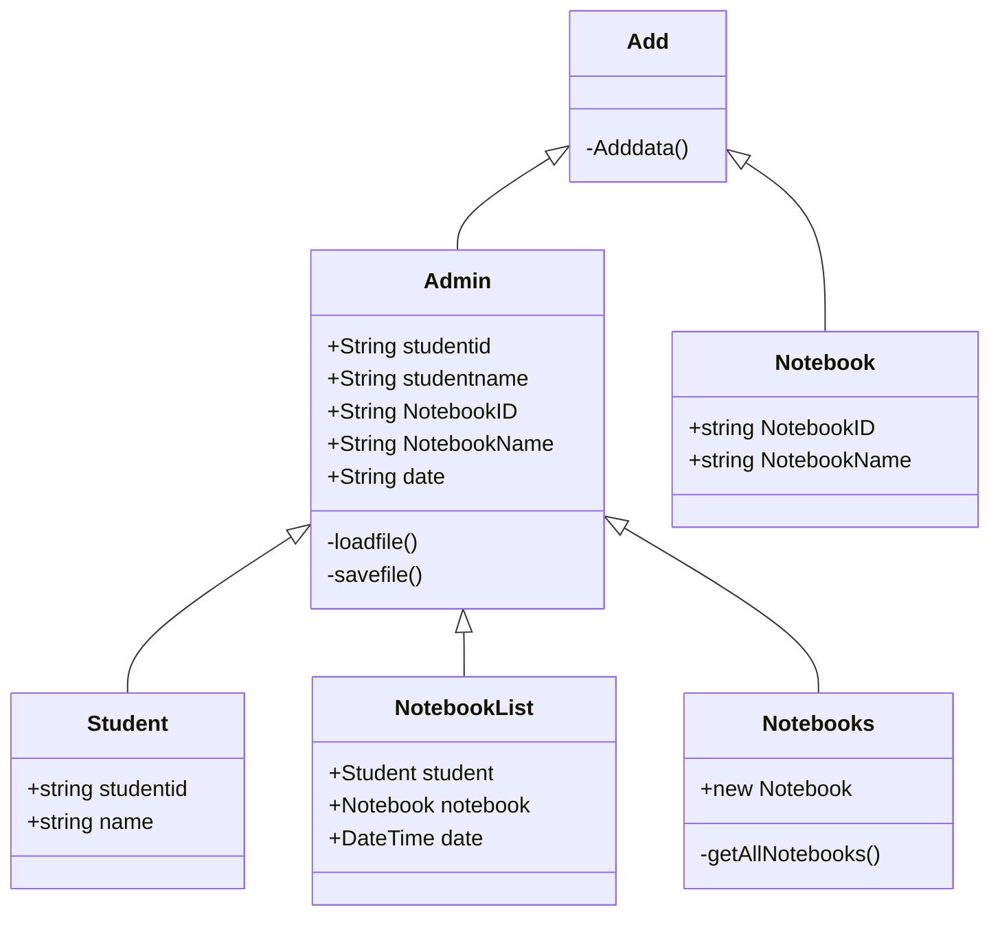

ความเป็นมา
```
    เนื่องจากว่าห้องสมุดมีการลงทะเบียนยืมโน๊ตบุ๊ค แต่ไม่รู้ว่าใครยืมเครื่องไหนไปแล้วบ้างก็เลยจึงสร้างโปรแกรมนี้ขึ้นมา
```
วัตถุประสงค์ของโปรแกรม
```
    อยากรู้ว่าใครยืมบ้าง โดยการ กรอกรหัสนศ.,ชื่อ-นามสกุล,รุ่นโน๊ตบุ๊ค,ระยะเวลา

```
Class Diagram

ชื่อผู้พัฒนา
```
นาย เมธากร สิงห์คาน
```